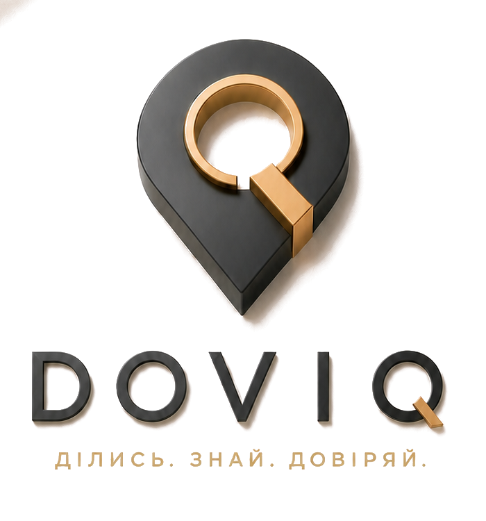
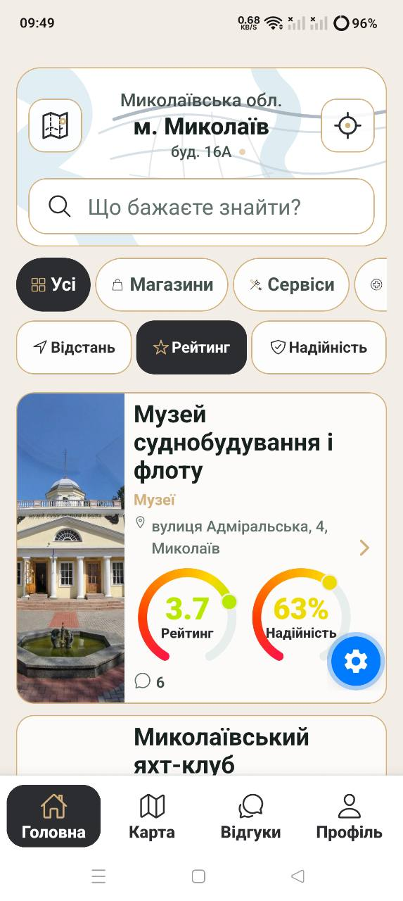
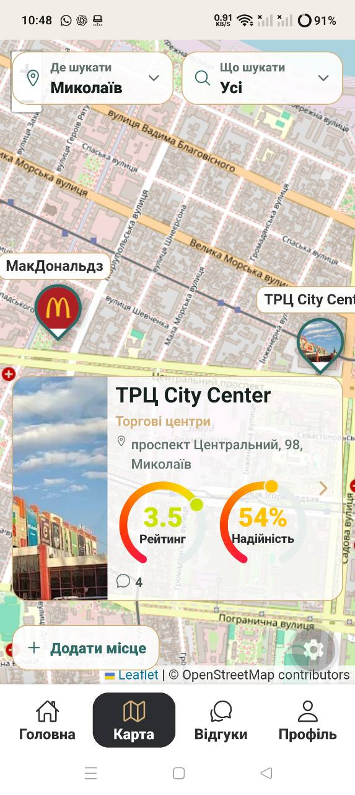
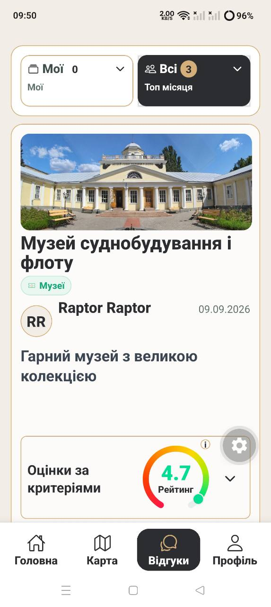

# DOVIQ

> Ділись. Знай. Довіряй.

DOVIQ — платформа місць, представництва, відгуків і доказової локальної
репутації. Будь-який користувач може подати відсутнє реальне місце. Власник або
уповноважена команда може заявити права на його сторінку й після перевірки стати
офіційним представником. Відвідувачі публікують структурований досвід, а система
окремо показує рейтинг місця та надійність сукупних даних.

Це чинна айдентика й подальший розвиток проєкту «Довіра» / Dovira, а не новий
непов’язаний продукт.

## Затверджена айдентика

Головний блок використовує затверджений master №16: чорний знак, чорний напис
`DOVIQ`, золоту вставку та слоган `Ділись. Знай. Довіряй.` Верхня смуга меню
використовує затверджений чорний lockup №4 без слогану. В обох веб-копіях
прибрано лише нейтральне світле полотно, щоб знак і напис стояли на тлі самої
сторінки; геометрія знака, центрування `V`, літери, кольори й пропорції не
змінювалися. Візуальна система показана на живих екранах застосунку, а не через
змішування технічних брендбордів.

## Що робить продукт іншим

- **Відкрите наповнення карти.** Користувач подає назву, категорію, координати,
  опис і підтвердження існування; модерація перевіряє місце до публікації.
- **Перевірене представництво.** Business claim відділяє офіційного
  представника від звичайного коментатора й відкриває контрольовані ролі команди.
- **Один користувач — один внесок у рейтинг.** До трьох епізодів автора про одне
  місце формують одну історію та один усереднений `AuthorRating`, а не три голоси.
- **Рейтинг і надійність не змішуються.** Рейтинг описує оцінену якість досвіду;
  надійність показує достатність даних з урахуванням кількості незалежних
  авторів, рівнів акаунтів і перевірених доказів.
- **Приватні докази залишаються приватними.** Інші користувачі бачать лише
  безпечний статус перевірки; доказ посилює надійність, але не підвищує зірки.
- **Репутація має продовження.** Відповідь представника, запропоноване вирішення,
  апеляція та зміна оцінки автором залишаються у прозорій історії.
- **Реклама не купує репутацію.** Комерційне розміщення не змінює рейтинг,
  надійність, рішення модерації чи видимість обґрунтованої критики.
- **Кожна фізична точка окрема.** Адреса, фото, рейтинг та історія належать
  конкретній філії, а не абстрактному бренду.

## Чому модель має інвестиційний потенціал

- **Універсальна потреба:** проблема довіри до локального досвіду існує в кожній
  місцевості, незалежно від країни.
- **Мережевий ефект:** люди додають місця й досвід, а представники доповнюють
  сторінки та працюють із відгуками; кожна сторона збільшує цінність для іншої.
- **Захисний шар даних:** зв’язки між місцями, авторами, доказами,
  представниками та історіями вирішення не зводяться до імпорту адрес.
- **Повторюваний запуск:** спільне технологічне ядро поєднується з локальною
  мовою, категоріями, модерацією, правилами та партнерствами.
- **Глобальний масштаб:** від контрольованого пілота в одному місті — до мережі
  локальних ринків, B2B-кабінетів, віджетів, API та агрегованої аналітики.

## Комерційна модель

Базові сторінки, відгуки й незалежна репутація створюють суспільну цінність.
Комерційний сегмент може платити за інструменти, які допомагають швидше й
системніше працювати з цією репутацією:

- аналітику, сповіщення й теми повторюваних проблем;
- командні ролі та workflow для відповідей;
- multi-location кабінет для мереж і філій;
- QR-запрошення, віджети та інтеграції;
- чітко позначене локальне просування;
- у майбутньому — ліди й бронювання після перевірки unit-економіки;
- агреговану територіальну аналітику без продажу персональних даних.

Незмінний принцип: DOVIQ монетизує інструменти роботи з репутацією, але не
продає рейтинг, надійність або рішення модератора.

## Перший ринок і масштабування

Миколаїв і Миколаївський район — перший контрольований ринок для доказу моделі,
а не географічна межа. Архітектура передбачає розширення на інші міста України,
а після локалізації мови, правил і операційного контуру — на інші країни без
перебудови базового репутаційного ядра.

## Актуальні живі екрани

У презентації використано три змістові фізичні кадри поточної збірки, надані 21
вересня 2026 року, без концептуальних макетів і без старих дизайн-checkpoint.
Системні панелі телефону візуально обрізані; презентаційний заголовок кожного
кадру показує однаковий час `09:50`, не змінюючи вміст самого застосунку.

| Головний екран | Карта | Відгуки |
| --- | --- | --- |
|  |  |  |

## Поточний стан

Створено робочу мобільну основу з авторизацією, каталогом і картою, поданням
нових місць, пошуком, сторінками фізичних філій, відгуками за критеріями,
приватними доказами, DOVIQ Rating v3, модерацією, business claims, захищеними
ролями та хмарною базою даних. Наступний етап — контрольований пілот і перевірка
продуктових та комерційних гіпотез на реальних користувачах.

## Код і підтвердження дати

Вихідний код зберігається в **закритому GitHub-репозиторії**. Цей публічний
репозиторій є презентацією проєкту й не містить вихідного коду. Публічний
криптографічний відбиток контрольного знімка та правила перевірки наведені у
[PROVENANCE.md](PROVENANCE.md).

Історія GitHub уже містить baseline проєкту «Довіра» від **15 липня 2026 року**.
Матеріали розділено на дві датовані епохи — **«Довіра» / Dovira** та
**DOVIQ**. Перехід документується як розвиток того самого продукту, без
видалення або переписування попередньої історії. Повна хронологія наведена в
[HISTORY.md](HISTORY.md).

## Права

Назва, фірмові матеріали, дизайн, тексти та оригінальні програмні компоненти
DOVIQ не надаються за відкритою ліцензією. Докладніше — в
[IP_NOTICE.md](IP_NOTICE.md).

© 2026 **Бойко Іван**.
Усі права застережено.
